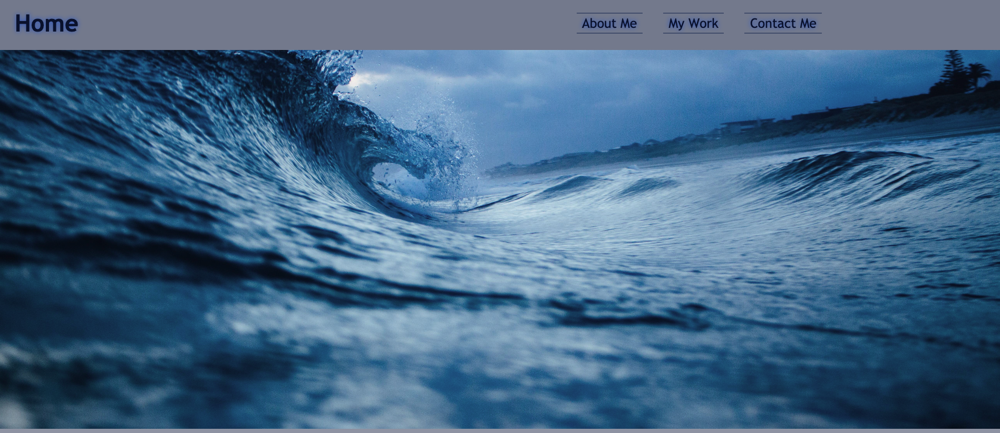
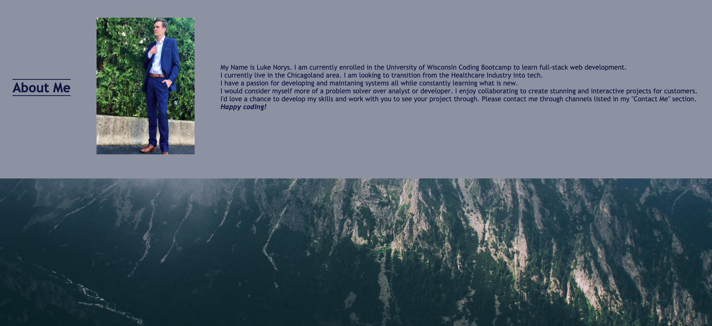
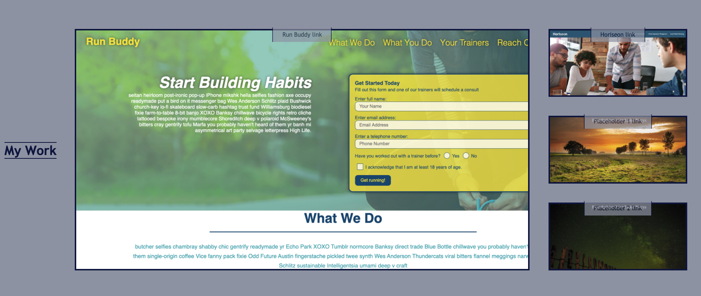
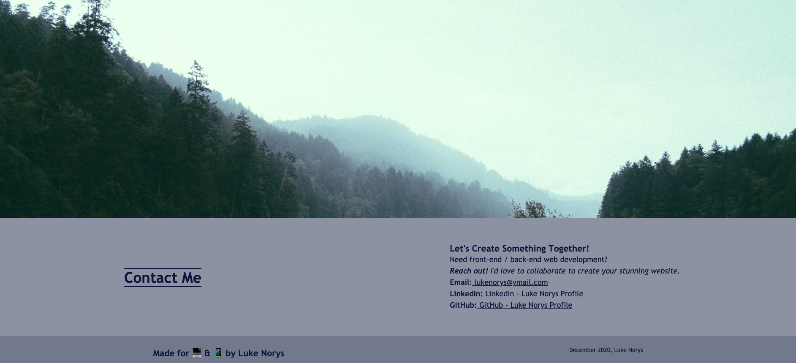
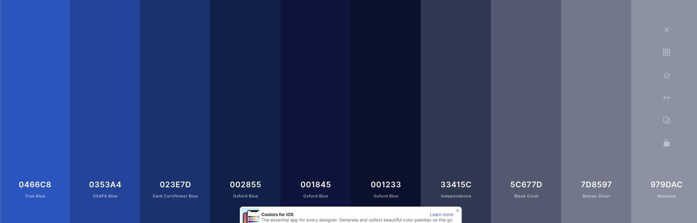
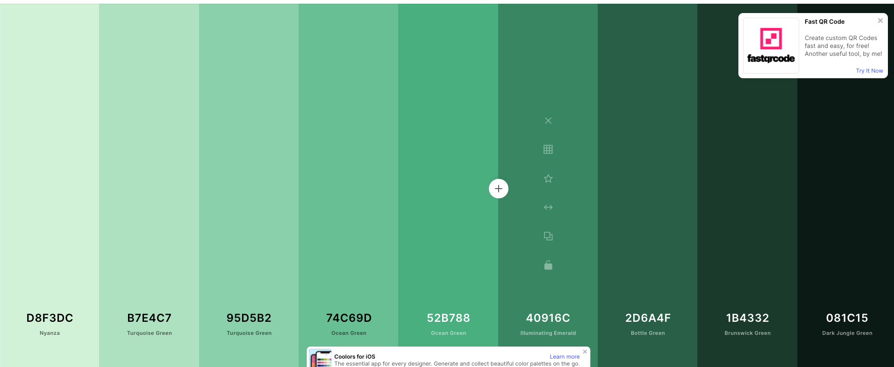

# luke norys portfolio

## DEPLOYED LINK
[Luke Norys Portfolio](https://lukenorys.github.io/lnorys_portfolio/)

## DESCRIPTION
### create personal portfolio

## TASKS
* nav bar brings to UI area
* about me section (update as needed)
* my work section (update as needed)
* contact section (update as needed)

## SCREENSHOTS
#### header contains nav bar (snake hover feature)

### ABOUT ME
#### basic info about me (edit in future)

### MY WORK
#### my work/repos with placeholders (edit in future)

### CONTACT/FOOTER
#### contact/footer/parallax3 (edit in future)

## COLOR PALETTES
### primary color palette for version 1.0

### seconday color palette for future versions (change based on certain criteria tbd)

## CURRENT VERSION
### v1.0